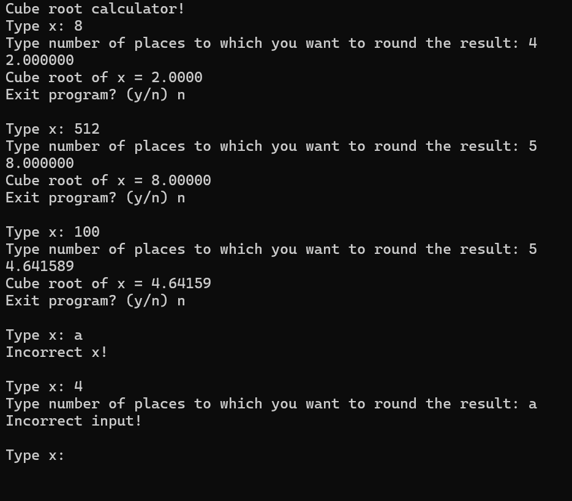

# Cube Root Calculator (C + x86 Assembly)

This is a simple console application written in C with an x86 Assembly subroutine. It calculates the cube root of a given floating-point number using the Newton-Raphson method.

## Features

- Accepts user input for a float `x`.
- Computes the cube root of `x` using a custom `cuberoot()` function written in NASM assembly.
- Allows the user to specify the number of decimal places for rounding the result.
- Input validation and graceful error handling.
- Option to repeat or exit after each computation.

## Iteration Algorithm

The cube root is approximated using the Newton-Raphson method, which iteratively solves equations of the form:

$x_{k+1} = x_k - \frac{f(x_k)}{f'(x_k)}$

The algorithm starts with $x_0 = x / 3$ and repeats the formula 1000 times for high precision. All calculations are performed using x86 FPU instructions.

## Examples




## Files

- `cuberoot.c`: Main C program handling input/output and calling the cube root function.
- `cuberoot.asm`: NASM assembly function implementing the cube root calculation.

## Requirements

- GCC (MinGW for Windows)
- NASM assembler

## Compilation (Windows, via command line)

```bash
nasm -f win32 cuberoot.asm -o cuberoot.obj
gcc -m32 cuberoot.c cuberoot.obj -o cuberoot.exe
